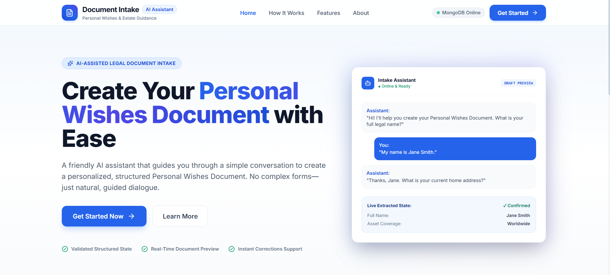
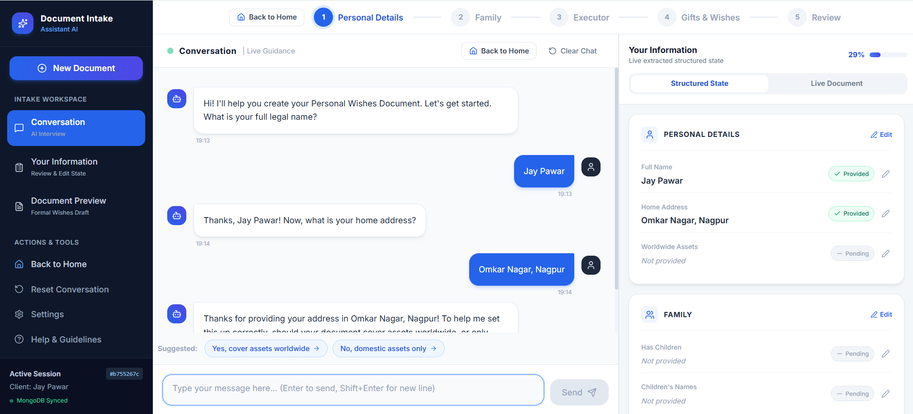
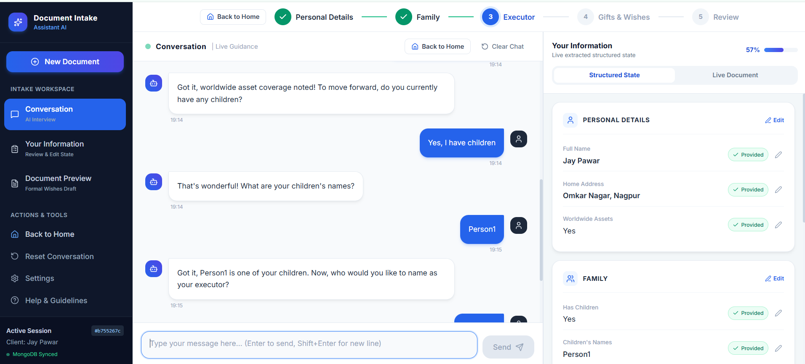
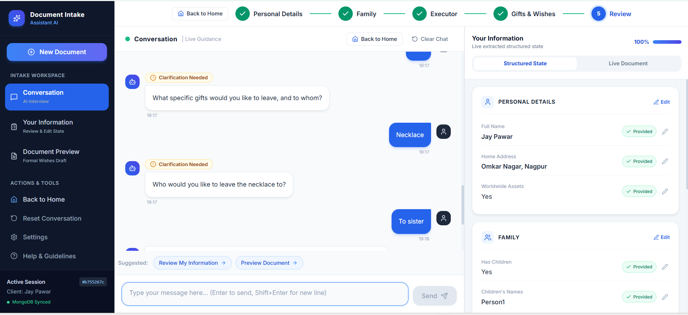
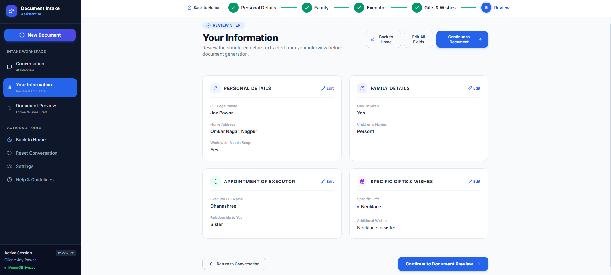
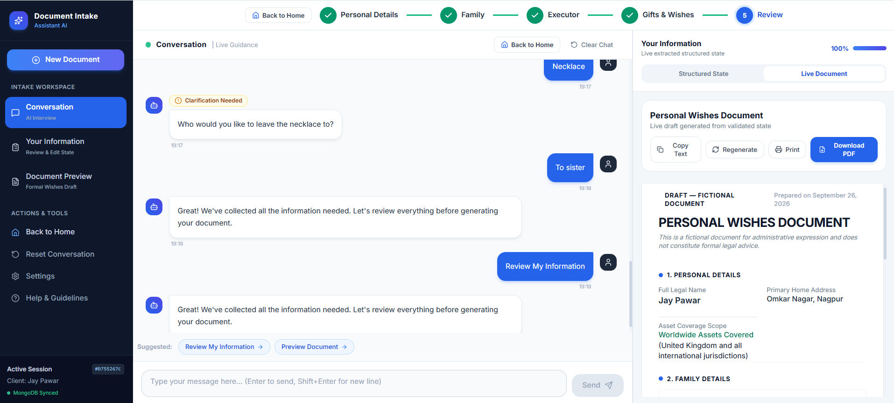
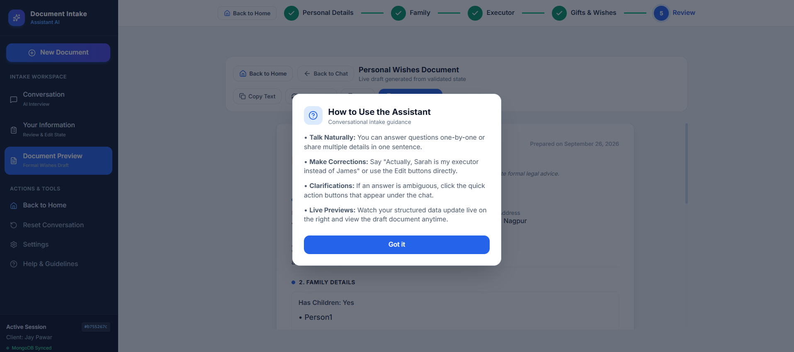
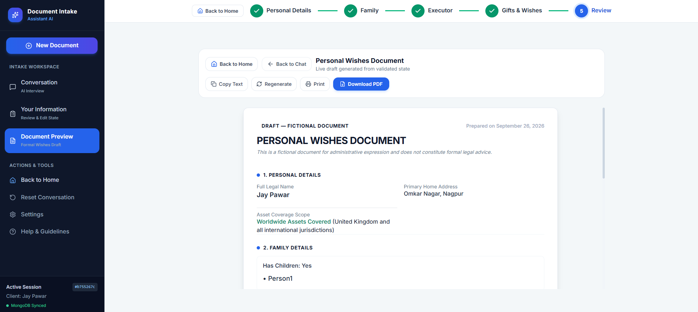

# Document Intake Assistant

An intelligent, full-stack conversational document intake application powered by Google's official **Gemini API** (`google-genai` SDK) and Pydantic structured outputs. It conducts intake interviews, extracts and validates structured state separately from conversation history, detects ambiguities and contradictions without silent overwrites, rejects irrelevant answers, and generates an executive, publication-grade **Personal Wishes Document** with live preview and downloadable PDF.

🚀 Live Demo: https://document-intake-assistant-iy7b.vercel.app/
The application is deployed with a Vercel frontend, Render FastAPI backend, MongoDB database, and Google Gemini API integration.

---

## 🌟 Overview

Traditional estate and legal intake forms are overwhelming and error-prone. The **Document Intake Assistant** replaces static forms with an empathetic, highly structured conversational interview powered by Google Gemini.

Rather than relying on the LLM's raw context window or allowing an AI model alone to steer the intake flow, the application implements a strict **multi-stage validation pipeline**:

1. **Gemini understands natural language**: extracts structured JSON with strict Pydantic schemas.
2. **Pydantic validates the schema**: ensures types, structure, and constraints are met.
3. **Backend business rules validate meaning**: enforces legal/domain logic such as child rules, gifts, and boolean answers.
4. **MongoDB persists state**: acts as the source of truth for the session.
5. **Deterministic Question Controller**: decides the next action and field, preventing loops and skipped fields.
6. **Executive Document Engine**: renders a formal legal draft in both interactive HTML and publication-grade PDF via ReportLab.

---

## ✨ Key Features & Capabilities

### 🤖 Google Gemini AI Integration

- Uses Google's official `google-genai` SDK.
- Structured JSON extraction with Pydantic models.
- Natural-language conversational intake.
- Multi-field extraction from a single user message.
- Context-aware follow-up questions.
- Gemini phrasing with deterministic fallback questions.

### 🛡️ Strict Validation & Reliability

- Strict input validation.
- Irrelevant answer rejection.
- Ambiguity detection.
- Contradiction detection.
- Explicit correction recognition.
- Prevents silent state overwrites.
- Deterministic question ordering.
- Business-rule validation independent of the LLM.

### 📋 Structured State Management

The application separates structured application state from raw conversation history.

Collected information includes:

- Personal Details
- Family Details
- Appointment of Executor
- Specific Gifts
- Additional Wishes

Each field maintains a status such as:

- `Confirmed`
- `Pending`
- `Not Applicable`

### 🎁 Structured Gifts & Wishes

Gifts are represented using structured information:

```text
{
    item,
    recipient_name,
    relationship,
    description
}
```

Additional wishes are also formatted into the final document.

### 🔄 Correction & Contradiction Handling

The system recognizes correction phrases such as:

- "actually"
- "instead of"
- "change to"
- "make that"

Contradictions are detected without blindly overwriting existing confirmed information.

For example:

```text
User:
I don't have any children.

Later:

User:
Actually, I have two children.
```

The system can identify the conflict and request clarification instead of silently changing the stored state.

### 🧭 Deterministic Question Controller

The backend determines:

- Which fields are still missing.
- Which field should be requested next.
- Whether the intake is complete.
- Whether clarification is required.

Gemini does not unilaterally determine interview completion.

### 💾 MongoDB Persistence

MongoDB stores:

- Intake sessions
- Conversation history
- Structured state
- Field statuses
- Generated document state

This allows session progress to survive navigation and application state changes.

### 🏠 Back to Home & Session Preservation

The application includes **Back to Home** navigation throughout the interface.

Active intake navigation displays a confirmation such as:

> "Leave intake? Your progress is saved."

Session state is preserved through `IntakeContext.jsx` and MongoDB.

### 📄 Executive PDF Generation

The document engine uses **ReportLab** to generate a professional Personal Wishes Document with:

- Document title
- Session reference ID
- Date prepared
- Document status
- Legal notice callout
- Personal Details
- Family
- Executor
- Gifts
- Wishes
- Two-column key-value tables
- Signature blocks
- Witness / Legal Reviewer section
- Running headers
- Dynamic `Page X of Y` footer

PDF pagination is implemented using a custom two-pass `NumberedCanvas`.

### 🖥️ Live Document Preview

The generated document can be viewed directly inside the application.

Users can:

- Review the document.
- Copy the document.
- Regenerate the document.
- Print the document.
- Download the PDF.

### ✏️ Interactive Review & Inline Editing

The dedicated review page allows users to edit collected information before final document generation.

Changes are synchronized with:

- MongoDB state
- Structured application state
- Generated document

### 🔁 Fallback & Reliability

If Gemini experiences rate limits or connectivity problems, the application uses:

- Automatic retries with backoff.
- Deterministic fallback question maps.
- Structured validation.
- Persistent session state.

This prevents the conversation from terminating unexpectedly.

---

# 🏗️ Architecture

```text
                         USER
                          │
                          ▼
                   REACT FRONTEND
                          │
                          ▼
                     FASTAPI API
                          │
                          ▼
                LOAD CURRENT SESSION
                          │
                          ▼
               LOAD STRUCTURED STATE
                          │
                          ▼
                GEMINI EXTRACTOR
                 google-genai SDK
                          │
                          ▼
                 STRUCTURED JSON
                  Pydantic Schema
                          │
                          ▼
                 PYDANTIC VALIDATION
                          │
                          ▼
              BUSINESS RULE VALIDATION
                          │
                 ┌────────┼─────────┐
                 ▼        ▼         ▼
               VALID   AMBIGUOUS  INVALID
                 │        │         │
                 ▼        ▼         ▼
              UPDATE   CLARIFY    REJECT
               STATE     USER       USER
                 │
                 ▼
               MONGODB
          Persisted Session State
                 │
                 ▼
       FIND NEXT REQUIRED FIELD
          Interview Controller
                 │
                 ▼
        GENERATE NEXT QUESTION
        Gemini / Fallback Map
                 │
                 ▼
              FRONTEND
                 │
                 ▼
        EXECUTIVE PDF ENGINE
              ReportLab
```

---

# 🛠️ Tech Stack

## Frontend

- React 18
- Vite
- React Router v6
- Tailwind CSS
- Lucide Icons
- Axios

## Backend

- Python 3.9+
- FastAPI
- Uvicorn
- Pydantic v2
- Pydantic Settings
- Motor
- HTTPX
- Google `google-genai` SDK

## AI / LLM

- Google Gemini API
- Structured JSON extraction
- Pydantic structured outputs
- Gemini conversational reasoning

## Database

- MongoDB
- Motor asynchronous MongoDB driver

## Document Generation

- ReportLab
- Custom `NumberedCanvas`
- Executive document layout
- Two-column tables
- Signature blocks
- Dynamic page numbering

## Testing

- Pytest
- Pytest-AsyncIO
- Unit tests
- Integration tests
- PDF generation tests
- Gemini extraction tests

---

# 📡 API Endpoints

| Method | Endpoint | Description |
| :--- | :--- | :--- |
| `GET` | `/api/health` | Health check for backend, database, and LLM provider |
| `POST` | `/api/sessions` | Create a new intake session |
| `GET` | `/api/sessions` | List all intake sessions |
| `GET` | `/api/sessions/{session_id}` | Retrieve session details |
| `GET` | `/api/sessions/{session_id}/messages` | Retrieve conversation history |
| `POST` | `/api/sessions/{session_id}/messages` | Send user message and get structured assistant response |
| `POST` | `/api/sessions/{session_id}/messages/reset` | Reset conversation history for the current session |
| `GET` | `/api/sessions/{session_id}/state` | Get current structured state and field statuses |
| `PATCH` | `/api/sessions/{session_id}/state` | Update structured state directly |
| `GET` | `/api/sessions/{session_id}/document` | Retrieve generated document bundle |
| `POST` | `/api/sessions/{session_id}/document/regenerate` | Force regeneration of document |
| `GET` | `/api/sessions/{session_id}/document/pdf` | Download executive publication-grade PDF |

---

# 📋 Configuration & Environment Variables

## Backend Configuration

Create:

```text
backend/.env
```

```env
# MongoDB
MONGODB_URI=mongodb://localhost:27017
MONGODB_DATABASE=document_intake_assistant

# LLM Configuration
LLM_PROVIDER=gemini
USE_MOCK_LLM=false
GEMINI_API_KEY=your_gemini_api_key_here
GEMINI_MODEL=gemini-3.5-flash-lite

# CORS & Server
FRONTEND_URL=http://localhost:5173
HOST=0.0.0.0
PORT=8000
```

> **Security Note:** `GEMINI_API_KEY` exists strictly on the backend and should never be exposed to the frontend or browser. `.env` files must not be committed to Git.

## Frontend Configuration

Create:

```text
frontend/.env
```

```env
VITE_API_URL=http://localhost:8000
```

For the Vercel deployment, the frontend production environment uses:

```env
VITE_API_URL=/api
```

---

# 🚀 Quick Start Guide

## 1. Start MongoDB

Ensure MongoDB is running locally on port `27017`.

### Windows PowerShell

```powershell
Test-NetConnection -ComputerName 127.0.0.1 -Port 27017
```

### Linux / macOS

```bash
mongosh --eval "db.adminCommand('ping')"
```

---

## 2. Backend Setup

```bash
cd backend
```

Create a virtual environment:

```bash
python -m venv venv
```

### Windows

```powershell
.\venv\Scripts\activate
```

### Linux / macOS

```bash
source venv/bin/activate
```

Install dependencies:

```bash
pip install -r requirements.txt
```

Configure your `GEMINI_API_KEY` inside:

```text
backend/.env
```

Start the backend:

```bash
python -m uvicorn app.main:app --host 127.0.0.1 --port 8000 --reload
```

Backend:

```text
http://127.0.0.1:8000
```

Swagger documentation:

```text
http://127.0.0.1:8000/docs
```

---

## 3. Frontend Setup

```bash
cd frontend
npm install
npm run dev
```

Frontend:

```text
http://localhost:5173
```

---

# ☁️ Deployment

The project can be deployed with a separate frontend/backend configuration.

The repository includes a `vercel.json` configuration for:

```text
React + Vite Frontend
        │
        ▼
     Vercel
        │
        ▼
     /api/*
        │
        ▼
   FastAPI Backend
        │
        ├── MongoDB
        │
        └── Gemini API
```

For production deployment, configure environment variables through the hosting platform rather than committing secrets to the repository.

---

# 🧪 Automated Testing

The project includes **23 automated tests** covering unit, integration, validation, contradiction, PDF generation, and Gemini extraction functionality.

Run the main test suite:

```bash
cd backend
.\venv\Scripts\activate

pytest -v tests/test_api_endpoints.py tests/test_contradiction_service.py tests/test_document_service.py tests/test_mock_llm.py tests/test_validation_service.py
```

Run live Gemini extraction tests:

```bash
pytest -v tests/test_gemini_extraction.py
```

## Test Coverage Highlights

### `test_document_pdf_generation`

Validates executive PDF generation with ReportLab, including:

- PDF byte headers
- Table structures
- Session references
- Empty intake states
- Filled intake states

### `test_gemini_multi_field_extraction`

Verifies extraction of:

- Full name
- Address
- Children boolean
- Executor
- Executor relationship

from a single conversational turn.

### `test_gemini_irrelevant_input_rejection`

Verifies irrelevant answers such as:

> "My favorite color is blue"

are rejected without polluting structured state.

### `test_gemini_ambiguous_input_detection`

Verifies ambiguous input such as:

> "Maybe I'll have children in the future"

is flagged as `AMBIGUOUS`.

### `test_gemini_specific_gifts_extraction`

Verifies multiple gifts are decomposed into structured:

- Items
- Recipients
- Relationships

### `test_gemini_all_in_one_message`

Verifies that all relevant fields can be populated and verified when provided together.

### `test_session_lifecycle`

Verifies:

- Conversational intake
- State persistence
- PATCH updates
- Document generation

---

# 🖼️ Application Screenshots

The following screenshots demonstrate the complete application workflow from the landing page through conversational intake, review, document generation, and live preview.

---

## 🏠 1. Home / Landing Page

The landing page introduces the Document Intake Assistant and provides the starting point for creating a Personal Wishes Document.



---

## 💬 2. Conversational Intake

The conversational interface guides the user through the intake process while the application extracts structured information in real time.



---

## 🛡️ 3. Executor Information

The application collects executor information and displays the progress of the intake workflow.



---

## 🎁 4. Gifts & Wishes

The assistant collects specific gifts and wishes through the conversational interface.



---

## 🔎 5. Information Review

The review page provides a structured view of the information collected during the intake process.

Users can verify and edit the information before document generation.



---

## 📄 6. Document Preview

The generated Personal Wishes Document is displayed in a professional document interface.

Available actions include:

- Copy
- Regenerate
- Print
- Download PDF



---

## ❓ 7. Help & Guidelines

The built-in help interface explains how to interact with the assistant, correct information, handle clarifications, and use the live document preview.



---

## 📝 8. Live Document Preview

The live document panel allows users to view the generated document while completing the intake process.



---

# 📄 Sample Generated Document

The application generates a structured **Personal Wishes Document** from the validated information collected during the conversational intake.

The generated document includes:

- Personal Details
- Family Details
- Appointment of Executor
- Specific Gifts & Wishes
- Additional Wishes
- Document reference information
- Date prepared
- Legal notice
- Signature section
- Witness / Legal Reviewer section
- Professional document formatting

### 📥 View Sample PDF

**[📄 View / Download Personal Wishes Document](sample-output/Personal-Wishes-Document.pdf)**

> **Note:** The sample document is provided for demonstration purposes. It is not a legally binding document and does not constitute legal advice.

---

# 🔄 Complete User Workflow

```text
                         HOME
                           │
                           ▼
                  START NEW DOCUMENT
                           │
                           ▼
                   PERSONAL DETAILS
                           │
                           ▼
                         FAMILY
                           │
                           ▼
                       EXECUTOR
                           │
                           ▼
                    GIFTS & WISHES
                           │
                           ▼
                        REVIEW
                           │
                           ▼
                  DOCUMENT PREVIEW
                           │
                    ┌──────┼──────┐
                    ▼      ▼      ▼
                  COPY   PRINT  DOWNLOAD
                                  PDF
```

---

# 🧠 AI Validation Workflow

```text
User Message
      │
      ▼
Gemini Extraction
      │
      ▼
Structured Pydantic Output
      │
      ▼
Schema Validation
      │
      ▼
Business Rule Validation
      │
      ├────────────────────┐
      │                    │
      ▼                    ▼
    VALID            INVALID / AMBIGUOUS
      │                    │
      ▼                    ▼
 Update State         Clarification
      │                    │
      ▼                    ▼
  MongoDB              User Input
      │
      ▼
Next Required Field
      │
      ▼
Next Question
```

---

# 📊 Project Highlights

| Area | Implementation |
| :--- | :--- |
| AI | Google Gemini API |
| Structured Extraction | Pydantic |
| Backend | FastAPI |
| Frontend | React + Vite |
| Database | MongoDB |
| PDF Generation | ReportLab |
| Validation | Schema + Business Rules |
| State Management | MongoDB + React Context |
| Navigation | React Router |
| API Communication | Axios |
| Testing | Pytest |
| Document Preview | Live HTML |
| PDF Download | REST API |
| Session Persistence | MongoDB |

---

# 🎯 Project Goals

The project focuses on building a reliable conversational intake system that combines:

- Generative AI
- Structured data extraction
- Deterministic business logic
- Persistent application state
- Human-readable document generation
- Professional frontend UX
- Automated validation and testing

The architecture separates **AI interpretation** from **application state management**, making the system more predictable, testable, and maintainable.

---

# 🔐 Security Considerations

Because the application handles potentially sensitive information:

- Never commit `.env` files.
- Never expose API keys in frontend code.
- Store API keys using environment variables.
- Use secure MongoDB credentials.
- Use HTTPS in production.
- Validate user input.
- Avoid logging sensitive personal information.
- Use appropriate authentication and authorization for production deployments.

---

# ⚠️ Disclaimer

This application is intended for **software demonstration, administrative intake, and informational purposes**.

The generated Personal Wishes Document does **not constitute legal advice** and should not be treated as a legally executed will, testament, estate plan, or other legally binding document.

Users should consult a qualified legal professional when formal legal documentation is required.

---

# 👨‍💻 Author

**Jay Pawar**

AI/ML • Full-Stack Development • Software Engineering

---

# ⭐ Support

If you find this project useful, consider giving the repository a ⭐ on GitHub.
